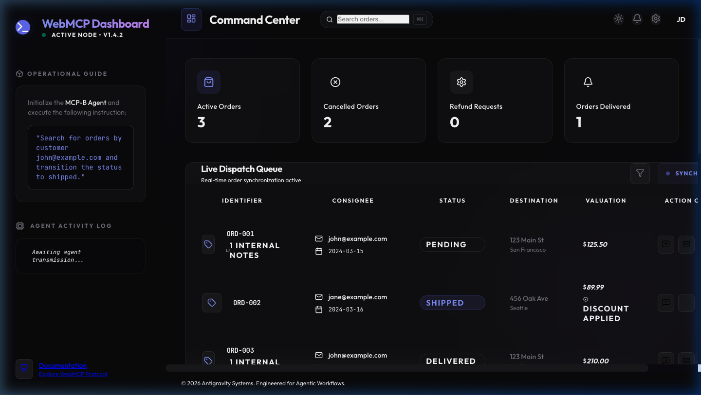

# WebMCP React Dashboard: Premium Enhancement Walkthrough

I have successfully transformed the WebMCP Dashboard into a premium, theme-aware application with expanded agentic capabilities. Every action available to AI agents now has a functional, discoverable manual counterpart.

## 🎨 Premium Theme & Light/Dark Mode
The dashboard now features a sophisticated design system supporting both **Light** and **Dark** modes. Transitions are smooth, and the "glass" aesthetics have been refined for maximum legibility in both themes.

````carousel

<!-- slide -->

````

## 🛒 Advanced Order Management (Manual Parity)
I have ensured full parity between WebMCP tools and the UI. New capabilities include:

1.  **Global Search**: A functional header search bar tagged with `data-toolname="search_orders"`.
2.  **Action Console**: Inline quick actions for **Refunds**, **Internal Notes**, **10% Discounts**, and **Cancellations**.
3.  **Order Creation**: A new "Create Order" form that is fully discoverable by agents.

### Verification of "Create Order" Workflow
I verified that orders can be created manually through the new form, with immediate updates to stats and search indexes.


## 🤖 Agent Activity & Transparency
The sidebar now includes a persistent **Agent Activity Log** that displays real-time actions performed by both humans and AI agents, ensuring transparency in collaborative workflows.

### Autonomous Tools Implementation
The following tools are now correctly registered and functional:
- `search_orders`
- `update_shipping_address`
- `issue_refund`
- `add_order_note`
- `cancel_order`
- `apply_discount`
- `create_order` [NEW]

> [!NOTE]
> All tools have been refactored to use standard React hooks patterns, resolving previous "Invalid Hook Call" issues.

## 📺 Full Verification Recording
Watch the complete verification of the theme toggle, search parity, manual actions, and order creation.


